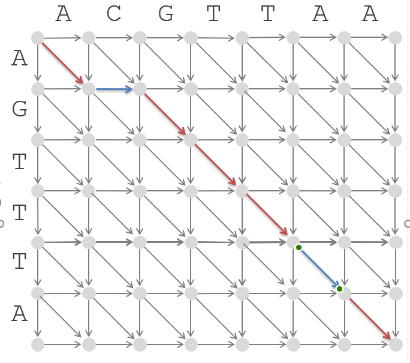
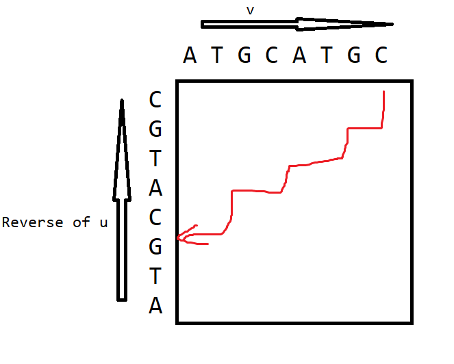

## HW2

Zhifeng Hu, 16307130177

### Problem 1

the de Brujin Graph of S is as follow.

```
     |----|
     v    |
--->GG----|
|    |
|    |
|    v
|   GT--->TA
|    |    |
|    |    |
|    v    v
|---TG<---AT
```

To euler-tour the de Brujin Graph, notice that the node GT has one more outgoing edge than ingoing edge, hence it is where the tour starts, conversely, node TA is the termination. The only branch is that GT has two equivelent outgoing edges, each stands for a valid tour path, so we have 2 possible answer.

And all the possible sequences are as follows

```
GTGGGTATG
GTATGGGTG
```

### Problem 2

Yes, because every node has balanced ingoing and outgoing edge number. `ABEADEHDGHIEFBCFIA`

### Problem 3

For the first 2-mer of each pair, the result sequence is `AGCAGCTGCT`, and for the second `AGCTGCTGA`, since the distance for the 2-mers are fixed 1, so we right shift the second sequence by 3, and merge the two sequence, the answer is `AGCAGCTGCTGA`.

### Problem 4

If we start from the vertex with the highest indegree, we are guaranteed to find a Eulerian cycle whatever arbitrary touring strategy is applied, because we can always go back to the start, and have other vertex visited, and the situation that we stuck at the beginning vertex while there are still vertex has non-visited associated edges will not occur.

While it is not always true that the first cycle is the Eulerian cycle, because there might exist other edges not visited.

### Problem 5

By the definition of theoretical mass spectrum, it consists of the mass of all subpeptids and 0 and the mass of the whole peptide. Considering NLYV is a cyclopetide, the answer is

```
0
V 99
L 113
N 114
Y 163
VN 213
NL 227
YV 262
LY 276
VNL 326
LYV 375
YVN 376
NLY 390
NLYV 489
```

### Problem 6

First of all, since we don't have the exact parent mass, so we have to modify the original LeaderboardCyclopeptideSequencing. we can apply the LeaderboardCyclopeptideSequencing algorithm without the 4th step, e.g. update the Leaderboard, and use a threshold M to eliminate too big peptides. The modified algorithm is as follow:

1. We denote a maximum possible mass for parent peptides MaxMass as the sum of the maximum mass in the spectrum T and the threshold M (e.g. 300 or so), conversely a minimum possible mass MinMass as T - M, and initiate a candidate parent set as an empty set CandiParentPeptides.
2. Add “0-peptide” to Leaderboard as LeaderPeptide.
3. Extend each peptide in Leaderboard by each of 18 different amino acid masses.
4. Cut low-scoring peptides from Leaderboard. (Keep “top N with ties”)
5. Eliminate all peptides with mass > MaxMass and put them into CandiParentPeptides.
6. For peptides in Leaderboard with mass > MinMass, put them into CandiParentPeptides
7. Iterate 3-6 until Leaderboard is empty.
8. Return peptides in CandiParentPeptides with highest score.

This algorithm preserves all possible parent peptides, and choose the one with the highest score from them, which must be the most possible parent peptide, and the mass of it is the parent mass.

### Problem 7

The alignment graph: (mismatches are denoted by blue arrow)



The corresponding path is

```
ACGTTAA
A-GTTTA
```

### Problem 8

This problem is actually no different from global alignment problem by looking at the two string from a different point of view.

We reverse the string of u, and find a path from top-right corner to bottom left, hence the path is a prefix of v and suffix of u. 



Formally, follow the setting of global alignment problem, we use $s[i,j]$ to denote the maximum alignment score of $u_{i,\cdots,n}$ and $v_{1,\cdots,j}$, e.g. the overlap alignment score of a prefix of v and suffix of u. Then we have
$$
s[i,j]=\mathbb{max} \begin{equation}
\left\{
\begin{array}{r@{\;=\;}l}
& s[i+1,j]+\mathbb {score}_{[i,j]\to[i+1,j]},\\
& s[i,j-1]+\mathbb {score}_{[i,j-1]\to[i,j]}, \\
& s[i+1,j-1]+\mathbb {score}_{[i,j]\to[i+1,j-1]} \\
\end{array}
\right \}
\end{equation}
$$
and the corner case is $s[n+1,0]=0$, the maximum among s is the optimal overlap alignment.

