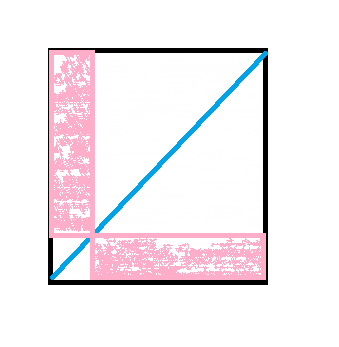

## HW3

Zhifeng Hu, 16307130177

### Problem 1

No always. For example

```
ATAT-
ATAT-
ATAT-
-TATA
-TATA
```

is the optimal multiple alignment, while for TATA and TATA, the optimal pairwise alignment is

```
TATA
TATA
```

### Problem 2

If we find the midNode on the diagonal, the calculation of each division will be more balanced. For example if n equals m, then no matter what the midNode is on the diagonal, each part of the division will have same area, hence the run time of the two subproblems will be approximately equal.



Even if n and m are not equal, empirically finding the midNode on the diagonal will still reduce the difference of area of the two division.


### Problem 3

1. Using the greedy approach,

   ```
   (+1, -3, -4, -2, +6, +7, -5, +8) 
   (+1, +2, +4, +3, +6, +7, -5, +8) 
   (+1, +2, -3, -4, +6, +7, -5, +8) 
   (+1, +2, +3, -4, +6, +7, -5, +8) 
   (+1, +2, +3, +4, +6, +7, -5, +8) 
   (+1, +2, +3, +4, +5, -7, -6, +8) 
   (+1, +2, +3, +4, +5, +6, +7, +8) 
   ```

2. The break points are (indicated by `|`)

   ```
   +1 | -3 | -4 | -2 | +6 +7 | -5 | +8 
   ```

3. 

### Problem 5

Not correct. If the counts are the same, then it can be wrong, for example

```
     A
    / \
   /   \
  A     C(A)
 / \    / \
A   A  A   C
```

Choose C will be inferior than choose A, while this algorithm can't always make the right decision.

### Problem 6

At the first step, the neighbor join distance matrix is

```
 0.  -4.8 -4.6 -4.6
-4.8  0.  -4.6 -4.6
-4.6 -4.6  0.  -4.8
-4.6 -4.6 -4.8  0. 
```

so the minimal pair is 2 and 3, we eliminate them and get the limes with edge length of 0.2 and 1 by calculating the $\Delta=(0.5 + 1.1+1.2)-(1.3+1.9+1.2))/2=-0.8$ and $\frac{1}{2}(1.2+0.8)=1$, $\frac{1}{2}(1.2-0.8)=0.2$. 

By removing the 2nd and 3rd columns and rows and adding a new column and row, the distant matrix becomes

```
  0.  -2.2 -2.2
 -2.2  0.  -2.2
 -2.2 -2.2  0.
```

where the last column and row stands for the parent of previous removed nodes denoted by number 4. Then again, we have two edges of length 0.2 and 0.8 for node 0 and 1 connecting their common parent node 5. Repeat removing and adding, there are only two nodes, 4 and 5, and the distance matrix becomes

```
0.  0.1
0.1 0.
```

So the distance is 0.1.

The tree as follow


To verify whether the given matrix is a additive matrix or not, we obtain the distance matrix from this tree, which is

```
0   1.0 0.5 1.3
1.0 0   1.1 1.9
0.5 1.1 0   1.2
1.3 1.9 1.2 0
```

This is the same as the initial matrix, which means the initial matrix is a additive matrix.

### Problem 7

In this case, we can devise a simple dynamic programming algorithm to solve it.

Suppose the given value is lied on the numerical axis, and from left to right, these values can be denoted by $v_i,i\in[1,n]$. Let $f[i][j]$ denotes the minimal sum of distance to $j$ centers for the first $i$ values. Then we have
$$
f[i][j] =\text{max}\left \{ f[l][j-1] + \mathbb{dis}(v_{l+1},\cdots,v_i)\right\}, l\in[j-1,i-1]
$$
where $dis(\cdots)$ is the sum of distance of values to the medium of these values, and the k-means clustering score is $f[n][k]$. We can do backtracking as what we did in calculating alignments, by segmenting these values into consecutive parts, each of them is a cluster.

This algorithm runs in polynomial time.


### Problem 8

For the coin A and B, the probability of the coin flip result is
$$
P(\mathtt {HTHHHHHTHH}|\theta_A)=\theta_A^8(1-\theta_A)^2= 0.002687\\
P(\mathtt {HTHHHHHTHH}|\theta_A)=\theta_B^8(1-\theta_B)^2= 0.000976
$$
Hence the responsibilities are approximately $0.733$ and $0.267$ respectively.


